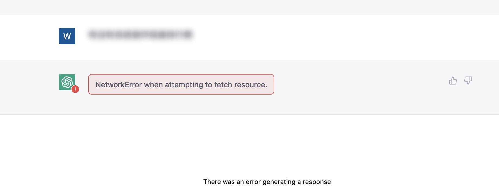
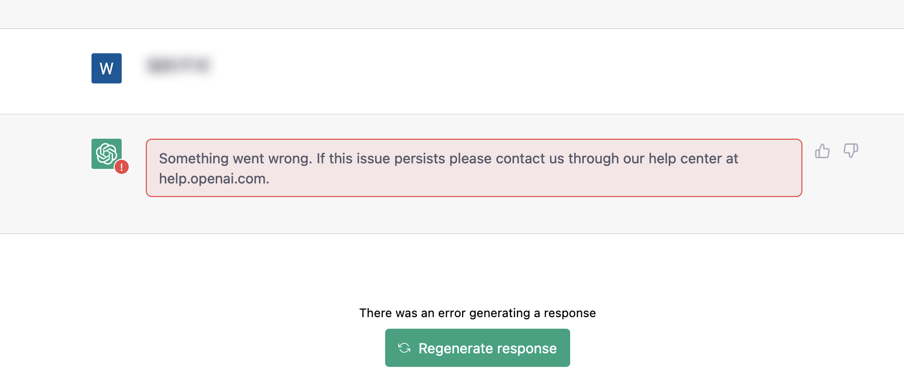
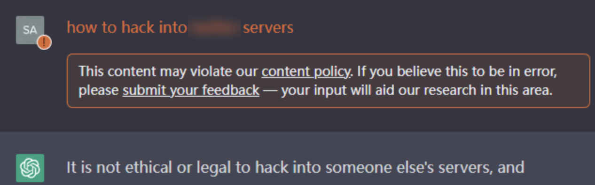
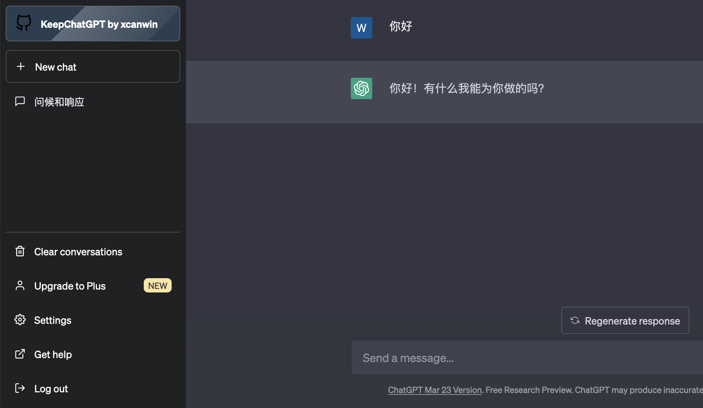

# KeepChatGPT

<br>

[中文文档](https://github.com/xcanwin/KeepChatGPT/blob/main/README.md) | [English README](https://github.com/xcanwin/KeepChatGPT/blob/main/README_EN.md)

<br>

## 简介

- 喜欢这个插件的小伙伴，可以给我的GITHUB项目 [KeepChatGPT](https://github.com/xcanwin/KeepChatGPT/) 点个STAR支持一下。
- 这是一款ChatGPT畅聊插件，让你不再遇到网络报错，不再需要刷新网页
- 解决了报错：NetworkError when attempting to fetch resource.
- 解决了报错：Something went wrong. If this issue persists please contact us through our help center at help.openai.com.
- 自由取消后台监管审计：This content may violate our content policy. If you believe this to be in error, please submit your feedback — your input will aid our research in this area.
- 解决被频繁地打断交流
- 解决频繁地刷新网页
- 支持多国语言
- 解决用户手误复制用户头像里的用户名的问题
- 解决了报错：Conversation not found

| 序号 | 使用```KeepChatGPT```插件以后再也不会出现以下场面 |
| --- | --- |
| 1 | </img> |
| 2 | </img> |
| 3 | </img> |
| 4 | </img> |

## 对比

| 实验环境 | 现象 | 步骤1 | 步骤2 | 步骤3 | 步骤4 | 步骤5 | 步骤6 | 步骤7 | 步骤8 | 步骤9 | 步骤10 | 步骤11 | 步骤12 | 步骤13 |
| --- | --- | --- | --- | --- | --- | --- | --- | --- | --- | --- | --- | --- | --- | --- |
| 不使用KeepChatGPT插件 | 聊天频频红框警告```NetworkError```，每隔十几分钟出现一次，必须刷新网页 | 下发指令 | 等待结果 | 遇到网络报错 | 尝试点击重新下发 | 再次遇到网络报错 | 复制刚刚的指令 | 刷新页面 | 等待网页加载完 | 打开刚刚的聊天会话 | 粘贴刚刚的指令 | 再次下发指令 | 再次等待结果 | 得到结果 |
| 使用KeepChatGPT插件 | 再也不会出现网络报错，再也不用刷新网页 | 下发指令 | 等待结果 | 得到结果 |  |  |  |  |  |  |  |  |  |  |

- 通过对比可知，足足省去10个多余的步骤，顺畅地聊天
- 享受免费的```KeepChatGPT畅聊用户专属金标```，它代表着你的AI体验发生了骤变：
- </img>
- 喜欢暗调的朋友可以鼠标移到```专属金标```选择```主题```修改为```专属蓝标```：
- </img>

## 原理

- 利用Headless绕过打开页面时的Cloudflare爬虫验证
- 利用non-click绕过不定时的Cloudflare机器人验证
- 保持流量最小化原则
- 鼠标移到```专属金标```选择```显示调试```可以查阅绕过过程

## 用法

1. 安装```Tampermonkey```浏览器拓展，可以从 [Tampermonkey官网](https://www.tampermonkey.net/) 安装；
2. 安装```KeepChatGPT```插件，可以从```安装渠道```选一个渠道安装；
3. 打开 [ChatGPT](https://chat.openai.com/chat) 尽情享用吧；
4. 另外，还有一个更巧妙的方法就是问ChatGPT：```如何安装tampermonkey拓展和greasyfork上的插件```

## 安装渠道

| 序号 | UserScript源 |
| --- | --- |
| 1 | [Github](https://raw.githubusercontent.com/xcanwin/KeepChatGPT/main/KeepChatGPT.user.js) |
| 2 | [GreasyFork](https://greasyfork.org/zh-CN/scripts/462804-keepchatgpt) |
