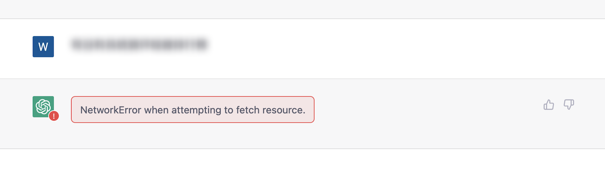
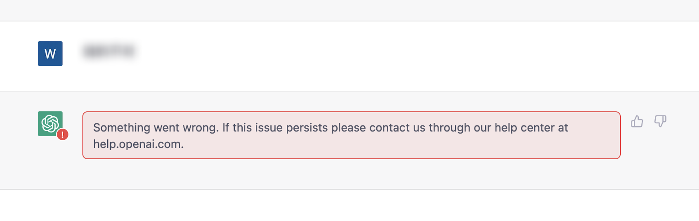
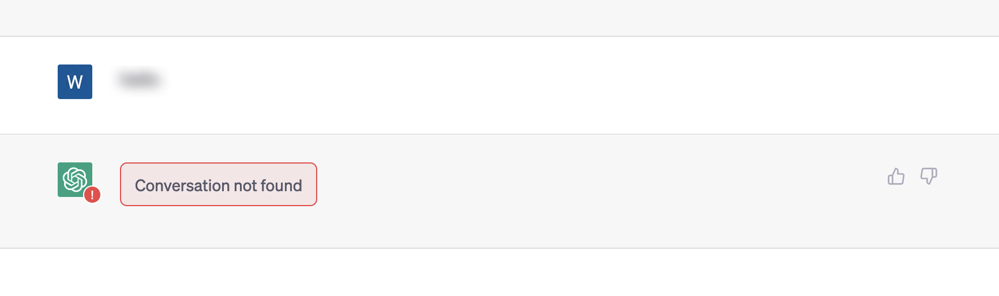
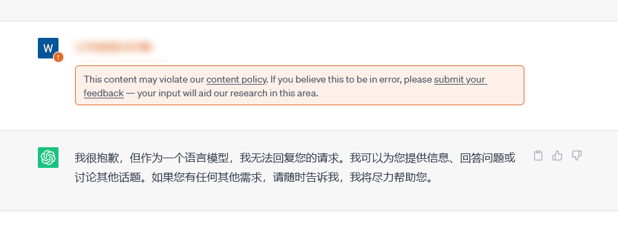
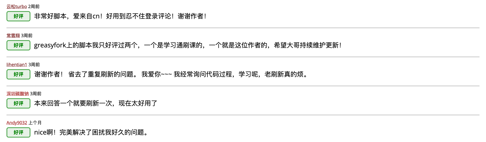
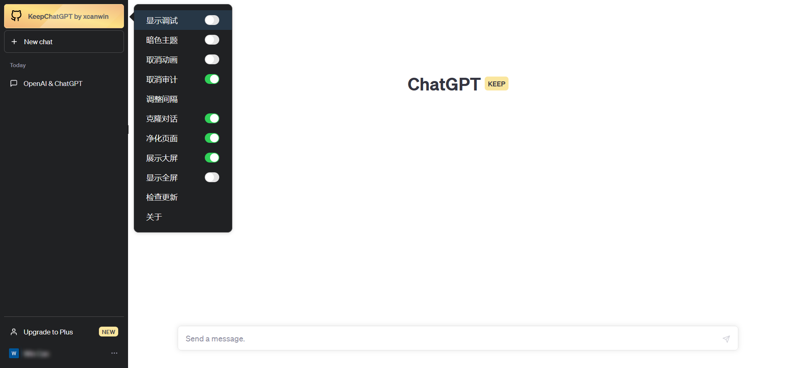
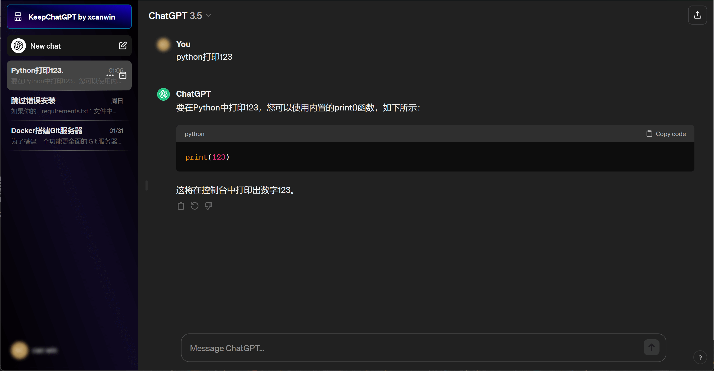
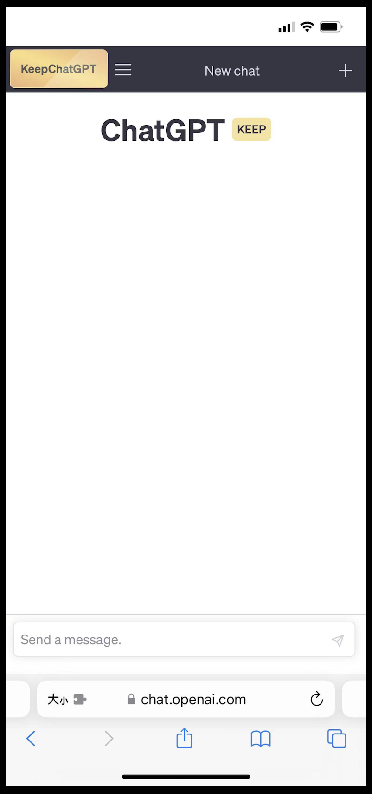

# KeepChatGPT

<br>

[中文文档](https://github.com/xcanwin/KeepChatGPT/blob/main/README.md) | [English README](https://github.com/xcanwin/KeepChatGPT/blob/main/README_EN.md)

<br>

## 简介

- 喜欢这个插件的小伙伴，可以给我的GITHUB项目 [KeepChatGPT](https://github.com/xcanwin/KeepChatGPT/) 点个STAR支持一下。
- 这是一款ChatGPT畅聊插件，让你不再遇到网络报错，不再需要刷新网页
- 解决了报错：NetworkError when attempting to fetch resource.
- 解决了报错：Something went wrong. If this issue persists please contact us through our help center at help.openai.com.
- 解决了报错：Conversation not found
- 解决了报错：This content may violate our content policy. If you believe this to be in error, please submit your feedback — your input will aid our research in this area.
- 解决被频繁地打断交流
- 解决频繁地刷新网页
- 支持多国语言
- 解决了用户常常手误复制用户头像里的用户名的问题
- 支持自由地[取消后台监管审计](#关于-取消审计-功能)
- 支持移动端([鸿蒙](#用法-鸿蒙系统)、[苹果](#用法-苹果系统))
- 支持自由地[调整时间间隔](#关于-调整间隔-功能)
- 本文底部的[```其他说明```](#其他说明)介绍了[```关于 为何会出现大规模地网络错误```](#关于-为何会出现大规模地网络错误)、菜单栏功能详情、常见的错误信息的原因和解决方案
- 创造不易，维护一个项目需要消耗时间、精力、技术，欢迎[```欣赏与赞赏```](#赞赏)

| 序号 | 使用```KeepChatGPT```插件以后再也不会出现以下场面 |
| --- | --- |
| 1 | </img> |
| 2 | </img> |
| 3 | </img> |
| 4 | </img> |

## 用户反馈

- 有好有坏
- 对于好的谢谢大家点赞
- 对于坏的会持续更新

</img>


## 对比

| 实验环境 | 现象 | 步骤1 | 步骤2 | 步骤3 | 步骤4 | 步骤5 | 步骤6 | 步骤7 | 步骤8 | 步骤9 | 步骤10 | 步骤11 | 步骤12 | 步骤13 |
| --- | --- | --- | --- | --- | --- | --- | --- | --- | --- | --- | --- | --- | --- | --- |
| 不使用KeepChatGPT插件 | 聊天频频红框警告```NetworkError```，每隔十几分钟出现一次，必须刷新网页 | 下发指令 | 等待结果 | 遇到网络报错 | 尝试点击重新下发 | 再次遇到网络报错 | 复制刚刚的指令 | 刷新页面 | 等待网页加载完 | 打开刚刚的聊天会话 | 粘贴刚刚的指令 | 再次下发指令 | 再次等待结果 | 得到结果 |
| 使用KeepChatGPT插件 | 再也不会出现网络报错，再也不用刷新网页 | 下发指令 | 等待结果 | 得到结果 |  |  |  |  |  |  |  |  |  |  |

- 通过对比可知，足足省去10个多余的步骤，顺畅地聊天

## 展示

- 享受免费的```KeepChatGPT畅聊用户专属金标```，它代表着你的AI体验发生了骤变：
- </img>
- 喜欢暗调的朋友可以鼠标移到```专属金标```选择```主题```修改为```专属蓝标```：
- </img>
- 移动端：
- </img>

## 原理

- 利用Headless绕过打开页面时的Cloudflare爬虫验证
- 利用non-click绕过不定时的Cloudflare机器人验证
- 保持流量最小化原则
- 鼠标移到```专属金标```选择```显示调试```可以查阅绕过过程

## 用法 电脑系统

1. 浏览器首选```Chrome```、```Firefox```、```Edge```，其他主流浏览器都是主动兼容这3个浏览器的；
2. 安装```Tampermonkey```浏览器拓展，可以从 [Tampermonkey官网](https://www.tampermonkey.net/) 安装；
3. 安装```KeepChatGPT```插件，可以从 [安装渠道](#安装渠道) 选一个渠道安装；
4. 打开 [ChatGPT](https://chat.openai.com/chat) 尽情享用吧；
5. 另外，还有一个更巧妙的方法就是问ChatGPT：```如何安装tampermonkey拓展和greasyfork上的插件```

## 用法 鸿蒙系统

1. 浏览器首选```Firefox```；
2. 安装```Firefox```浏览器App，可以从 [华为应用市场](https://appgallery.huawei.com/app/C31765)、[Firefox官网](https://www.mozilla.org/firefox/browsers/mobile/android/) 安装；
3. 打开```Firefox```浏览器App > 右下角```...``` > 附加组件 > 附加组件管理器 > ```Tampermonkey```右边的```+```；
4. 安装```KeepChatGPT```插件，可以从 [安装渠道](#安装渠道) 选一个渠道安装；

## 用法 苹果系统

1. 浏览器首选```Safari```，其他浏览器受限于苹果的政策少有支持JS插件的；
2. 安装```Stay```浏览器拓展App，可以从 [App Store](https://apps.apple.com/app/id1591620171) 安装；
3. 使用说明参考[Stay官网](https://github.com/shenruisi/Stay)；
4. 安装```KeepChatGPT```插件，可以从 [安装渠道](#安装渠道) 选一个渠道安装；

## 安装渠道

| 序号 | UserScript源 |
| --- | --- |
| 1 | [Github](https://raw.githubusercontent.com/xcanwin/KeepChatGPT/main/KeepChatGPT.user.js) |
| 2 | [GreasyFork](https://greasyfork.org/zh-CN/scripts/462804-keepchatgpt) |

## 其他说明

### 关于 为何会出现大规模地网络错误

1. 全球已出现算力荒，openai同样存在。
2. openai大火，用户量、用户在线时长、用户使用频率同时激增，导致加剧资源紧张。
3. 衍生出大量AI产品、AI机器人，都在私下调用ChatGPT的API和网页版ChatGPT，甚至调用频率远超所有真实用户的总和。
4. openai接入```Cloudflare```，开启```强力保护规则```，拦截私下接入openai的AI产品、AI机器人。
5. 就像图形验证码一样，本意是拦截机器人，可是一旦出现验证码被识别的风险，网站管理员就会把图形验证码开发得更复杂，影响了真实用户，但又确实拦截了机器人。
6. ```Cloudflare```是公共服务，它服务于所有网站，它的保护规则和风控策略是通用的。很多不希望被爬虫、被机器人访问、被黑客攻击、被大流量访问的网站都会接入Cloudflare，所以Cloudflare有丰富的风控策略。
7. 大量国外用户是家庭网络，Cloudflare判断他们的网络没有风险，所以他们几乎没报错。
8. 大量国内用户使用各种```位移魔法```(下面简称```666```)，然而很多```666```的ip曾经或者正在被Cloudflare列入了```强力保护规则```的重点关照名单里。不一定是用户本人导致的，可能是前人乘凉 后人遭殃，也可能是同C段的很多ip此时此刻还在频繁地触发风控，也可能用户本人都不知道自己使用的是共享```666```，触发了风控，Cloudflare判断他们的网络存在风险，于是出现报错，需要验证真实用户。
9. 原因不仅限以上内容，这里仅仅是抛砖引玉。

### 关于 取消审计 功能

1. 默认情况下，你所有的对话都会被openai官方自动化[审计](https://platform.openai.com/docs/guides/moderation/overview)，如果openai审计发现你有过多的违规、违反 [openai政策](https://openai.com/policies/usage-policies) 的对话，你的账号就存在被限制甚至被封号的风险。
2. 通过```勾选```本插件的```取消审计```功能加上你巧妙的提示词，可以最大程度地免受影响。

### 关于 调整间隔 功能

1. 那个值指的是```keep```(保活)的时间间隔，单位是```秒```。
2. 时间间隔越大，keep的速度就越慢，对网站的影响就越小，你的账号就越安全。
3. 时间间隔越小，keep的速度就越快，你的网络错误就越不会出现。
4. 建议间隔```30```秒以上。
5. 作者平时设置的是```150```秒。

### 关于 使用了本插件依然出现网络错误 的原因和解决方案

1. 原因: 参考 [```关于 调整间隔 功能```](#关于-调整间隔-功能)。解决方案: 适度调整keep的间隔。
2. 原因: 参考 [```关于 为何会出现大规模地网络错误```](#关于-为何会出现大规模地网络错误)。解决方案: 更换```666```的ip、机房、运营商、渠道，一个人的```666```才是最香的。

### 关于 其他错误 的原因和解决方案

1. 出现下述错误信息可参考官方的解决方案: [openai官方文档 报错代码](https://openai.com/policies/usage-policies)
2. 401 - Invalid Authentication
3. 401 - Incorrect API key provided
4. 401 - You must be a member of an organization to use the API
5. 429 - Rate limit reached for requests
6. 429 - You exceeded your current quota, please check your plan and billing details
7. 429 - The engine is currently overloaded, please try again later
8. 500 - The server had an error while processing your request

### 关于 错误信息429 - Too many requests in 1 hour. Try again later 的原因和解决方案

1. 首先，429错误有好多种，先确认是不是 [```关于 其他错误 的原因和解决方案```](#关于-其他错误-的原因和解决方案) 里的429错误。如果不是，那以下几种可能:
2. 原因: 新注册或者同一手机注册的用户，openai不赠送免费额度，查询链接 [openai官网 额度页面](https://platform.openai.com/account/usage)，解决方案: 换邮箱和手机号注册。
3. 原因: 用完了额度，查询链接 [openai官网 额度页面](https://platform.openai.com/account/usage)，解决方案: 充值变强。
4. 原因: Cloudflare的bug，解决方案: 使用浏览器的隐私模式等chatgpt，如果发现隐私模式能正常使用，就清理浏览器正常模式的openai.com主域名和子域名的所有cookie和本地存储。
5. 原因: 可能连你都不知道自己使用的是共享```666```，你有一群```相同ip出口的网上邻居```，他们一直在以各种目的频繁请求，虽然他们的访问量很大但是他们一直控制在临界点不触发429错误，而你使用了本插件以后把他们拖下水了，所以在你懵逼为何429的时候你的网上邻居们也在懵逼为何突然429，解决方案: 更换```666```的ip、机房、运营商、渠道，一个人的```666```才是最香的。

### 关于 PLUS用户是不是不会报错

- PLUS用户和普通用户一样，在劫难逃。

## 赞赏

- 如果本项目对你有帮助
- 如果本项目提高了你工作效率
- 如果你觉得本项目有用、好用
- 如果你希望本项目持续维护，以继续防止openai接下来新的一轮的报错
- 如果你希望本项目持续升级更多的功能
- ```创造不易，维护一个项目需要消耗时间、精力、技术，欢迎欣赏与赞赏```
- 可在备注里```写上你的用户名、ID```，谢谢

| Thanks |
| --- |
| [☕ buymeacoffee](https://www.buymeacoffee.com/xcanwin) |
| </img> |
