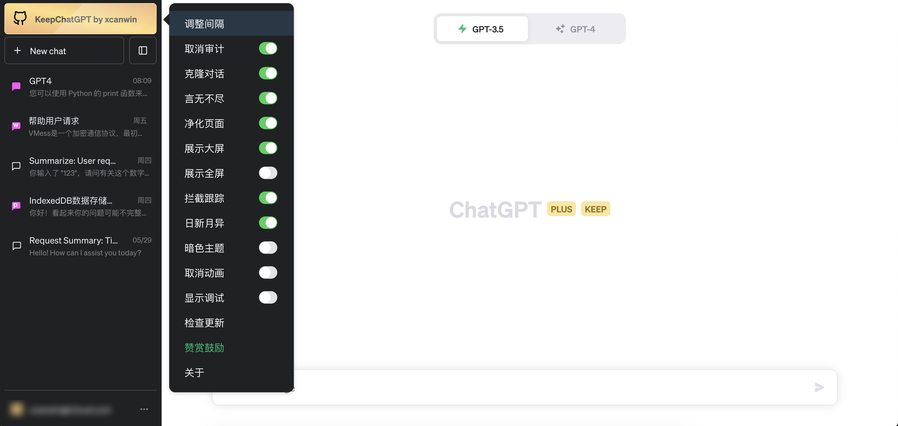
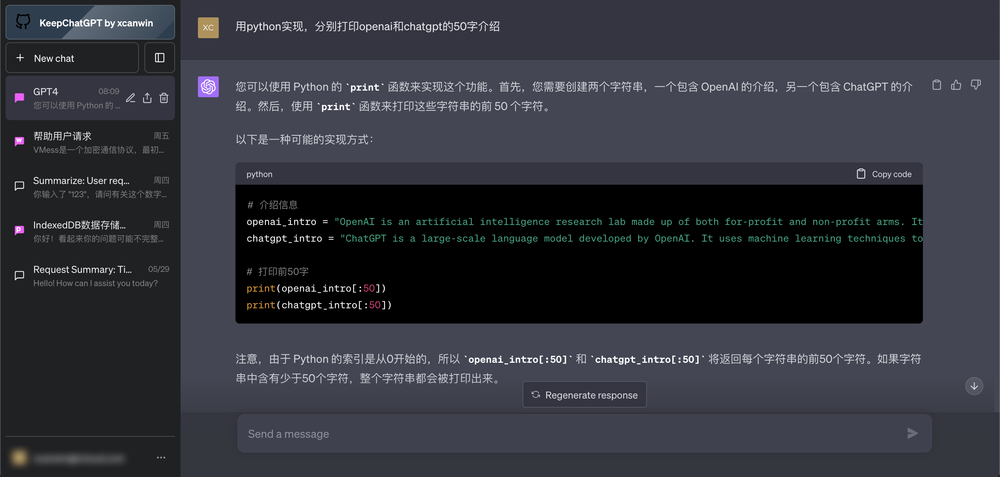

# KeepChatGPT

<br>

[中文文档](https://github.com/xcanwin/KeepChatGPT/blob/main/README.md) | [English README](https://github.com/xcanwin/KeepChatGPT/blob/main/README_EN.md)

<br>

## 简介

- 喜欢这个插件的小伙伴，可以给我的GITHUB项目 [KeepChatGPT](https://github.com/xcanwin/KeepChatGPT/) 点个STAR支持一下。
- 这是一款ChatGPT畅聊插件，让你不再遇到网络报错，不再需要刷新网页
- 解决了报错：NetworkError when attempting to fetch resource.
- 解决了报错：Something went wrong. If this issue persists please contact us through our help center at help.openai.com.
- 解决了报错：Conversation not found
- 自由取消后台监管审计：This content may violate our content policy. If you believe this to be in error, please submit your feedback — your input will aid our research in this area.
- 解决被频繁地打断交流
- 解决频繁地刷新网页
- 支持多国语言
- 解决用户手误复制用户头像里的用户名的问题
- 兼容移动端
- 支持自由调整频率
- 本文底部的```其他说明```为大家普及了```为何会出现大规模地网络错误```，以及介绍```KeepChatGPT```的部分功能详情

| 序号 | 使用```KeepChatGPT```插件以后再也不会出现以下场面 |
| --- | --- |
| 1 | </img> |
| 2 | </img> |
| 3 | </img> |
| 4 | </img> |

## 对比

| 实验环境 | 现象 | 步骤1 | 步骤2 | 步骤3 | 步骤4 | 步骤5 | 步骤6 | 步骤7 | 步骤8 | 步骤9 | 步骤10 | 步骤11 | 步骤12 | 步骤13 |
| --- | --- | --- | --- | --- | --- | --- | --- | --- | --- | --- | --- | --- | --- | --- |
| 不使用KeepChatGPT插件 | 聊天频频红框警告```NetworkError```，每隔十几分钟出现一次，必须刷新网页 | 下发指令 | 等待结果 | 遇到网络报错 | 尝试点击重新下发 | 再次遇到网络报错 | 复制刚刚的指令 | 刷新页面 | 等待网页加载完 | 打开刚刚的聊天会话 | 粘贴刚刚的指令 | 再次下发指令 | 再次等待结果 | 得到结果 |
| 使用KeepChatGPT插件 | 再也不会出现网络报错，再也不用刷新网页 | 下发指令 | 等待结果 | 得到结果 |  |  |  |  |  |  |  |  |  |  |

- 通过对比可知，足足省去10个多余的步骤，顺畅地聊天

## 展示

- 享受免费的```KeepChatGPT畅聊用户专属金标```，它代表着你的AI体验发生了骤变：
- </img>
- 喜欢暗调的朋友可以鼠标移到```专属金标```选择```主题```修改为```专属蓝标```：
- </img>
- 移动端：
- </img>

## 原理

- 利用Headless绕过打开页面时的Cloudflare爬虫验证
- 利用non-click绕过不定时的Cloudflare机器人验证
- 保持流量最小化原则
- 鼠标移到```专属金标```选择```显示调试```可以查阅绕过过程

## 电脑端用法

1. 安装```Tampermonkey```浏览器拓展，可以从 [Tampermonkey官网](https://www.tampermonkey.net/) 安装；
2. 安装```KeepChatGPT```插件，可以从本文底部的```安装渠道```选一个渠道安装；
3. 打开 [ChatGPT](https://chat.openai.com/chat) 尽情享用吧；
4. 另外，还有一个更巧妙的方法就是问ChatGPT：```如何安装tampermonkey拓展和greasyfork上的插件```

## 苹果端用法

1. 安装```Stay```浏览器拓展App，可以从 [App Store](https://apps.apple.com/app/id1591620171) 安装；
2. 使用说明参考[Stay官网](https://github.com/shenruisi/Stay)；
3. 安装```KeepChatGPT```插件，可以从本文底部的```安装渠道```选一个渠道安装；

## 安装渠道

| 序号 | UserScript源 |
| --- | --- |
| 1 | [Github](https://raw.githubusercontent.com/xcanwin/KeepChatGPT/main/KeepChatGPT.user.js) |
| 2 | [GreasyFork](https://greasyfork.org/zh-CN/scripts/462804-keepchatgpt) |

## 其他说明

```
关于 为何会出现大规模地网络错误
```

1. 全球已出现算力荒，openai同样存在。
2. openai大火，用户量、用户在线时长、用户使用频率同时激增，导致加剧资源紧张。
3. 衍生出大量AI产品、AI机器人，都在私下调用ChatGPT的API和网页版ChatGPT，甚至调用频率远超所有真实用户的总和。
4. openai接入```Cloudflare```，开启```强力保护规则```，拦截私下接入openai的AI产品、AI机器人。
5. 就像图形验证码一样，本意是拦截机器人，可是一旦出现验证码被识别的风险，网站管理员就会把图形验证码开发得更复杂，影响了真实用户，但又确实拦截了机器人。
6. ```Cloudflare```是公共服务，它不仅服务与openai，它的保护规则是面向所有网站的。很多不希望被爬虫、被机器人访问、被黑客攻击、被大流量访问的网站都会接入Cloudflare。所以Cloudflare有各种各样的风控策略。
7. 大量国外用户是家庭网络，Cloudflare判断他们的网络没有风险，所以他们几乎没报错。
8. 大量国内用户使用各种梯子，然而很多梯子的ip曾经被Cloudflare列入了```强力保护规则```的重点关照名单里。不一定是用户本人导致的，可能是前人乘凉 后人遭殃，也可能是同C段的很多ip此时此刻还在频繁地触发风控，也可能用户本人都不知道自己使用的是共享梯子，Cloudflare判断他们的网络存在风险，于是出现报错，需要验证真实用户。
9. 原因不仅限以上内容，这里仅仅是抛砖引玉。

```
关于 取消审计 功能
```

因为你每一次的聊天都会被审计，如果发太多违规、违反 [openai政策](https://openai.com/policies/usage-policies) 的内容，账号就存在被限制甚至被封号的风险，通过本插件的```取消审计```功能加上你巧妙的提示词，可以最大层度地免受影响。

```
关于 调整频率 功能
```

1. 那个值指的是```keep```(保活)的时间间隔，单位是```秒```。
2. 时间间隔越大，keep的速度就越慢，对网站的影响就越小，你的账号就越安全。
3. 时间间隔越小，keep的速度就越快，你的网络错误就越不会出现。
4. 建议间隔```30```秒以上。
5. 作者平时设置的是```150```秒。

```
关于 使用了本插件依然出现网络错误
```

1. 解决方案1: 适度调整keep的间隔，原理请参考```关于 调整频率 功能```。
2. 解决方案2: 更换梯子ip或者更换梯子运营商，原理请参考```关于 为何会出现大规模地网络错误```。
