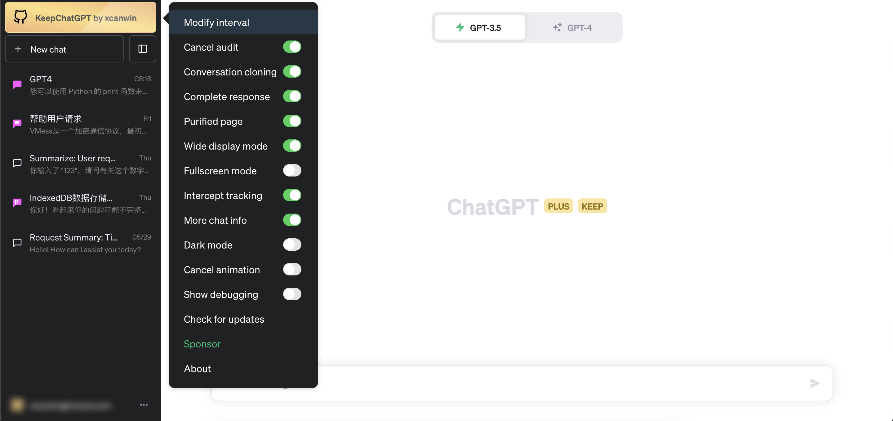
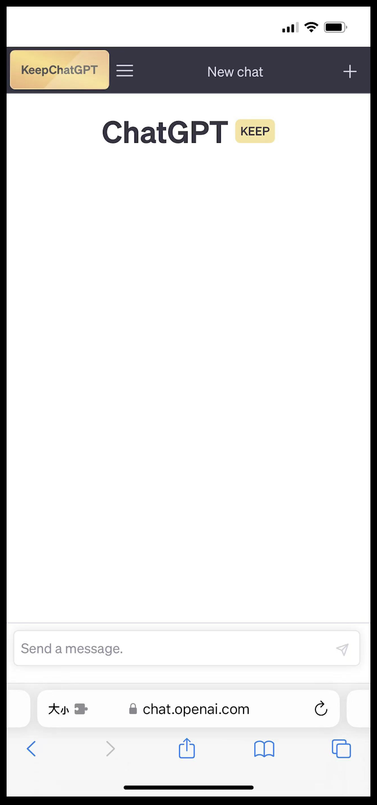

# KeepChatGPT

<br>

[中文文档](README.md) | [English README](README_EN.md)

<br>

## Introduction

- If you like this script, please support my GitHub project [KeepChatGPT](https://github.com/xcanwin/KeepChatGPT/) by giving it a STAR.
- A UserScript that enables ChatGPT to chat smoothly, never experiencing network errors again, and no need to refresh the webpage anymore.
- Resolved error: NetworkError when attempting to fetch resource.
- Resolved error: Something went wrong. If this issue persists please contact us through our help center at help.openai.com.
- Resolved error: Conversation not found
- Cancel audit: This content may violate our content policy. If you believe this to be in error, please submit your feedback — your input will aid our research in this area.
- Resolved frequent interruptions during communication
- Resolved frequent webpage refreshing
- Supports multiple languages
- Resolved the issue of accidentally copying user avatars
- Mobile-compatible

| Num | After using ```KeepChatGPT```, the following scene will never occur again |
| --- | --- |
| 1 | </img> |
| 2 | </img> |
| 3 | </img> |
| 4 | </img> |

## Comparison

| Experimental Environment | Phenomenon | Step 1 | Step 2 | Step 3 | Step 4 | Step 5 | Step 6 | Step 7 | Step 8 | Step 9 | Step 10 | Step 11 | Step 12 | Step 13 |
| --- | --- | --- | --- | --- | --- | --- | --- | --- | --- | --- | --- | --- | --- | --- |
| Without using ```KeepChatGPT``` | Frequent red warning boxes NetworkError in the chat, appearing every ten minutes or so, requiring the webpage to be refreshed | Issue the prompt | Wait for the result | Encounter a network error | Attempt to click to resend | Encounter the network error again | Copy the previous prompt | Refresh the webpage | Wait for the webpage to finish loading | Open the previous chat session | Paste the previous prompt | Issue the prompt again | Wait for the result again | Obtain the result |
| Using ```KeepChatGPT``` | There will never be network errors again, and there is no need to refresh the webpage | Issue the prompt | Wait for the result | Obtain the result | | | | | | | | | | |

- By comparison, it can be seen that it saves more than 10 unnecessary steps and enables smooth chatting.

## Show

- Enjoy the free "Exclusive Gold Label," which represents a dramatic change in your AI experience:
- </img>
- For friends who like dark tones, you can hover over the "Exclusive Gold Label" with your mouse and select "Theme" to change it to "Exclusive Blue Label":
- </img>
- Moblie:
- </img>

## Explanation

- Bypass Cloudflare's spider verification during page opening using Headless.
- Bypass Cloudflare's random machine verification using non-click.
- Maintain the principle of minimizing traffic.
- Move the mouse over "Exclusive Gold Label" and select "Show Debugging" to view the bypass process.

## Usage

1. Install ```Tampermonkey``` browser extension from [Tampermonkey website](https://www.tampermonkey.net/).
2. Install ```KeepChatGPT```, you can select a repository from ```Installation repositories```.
3. Open [ChatGPT](https://chat.openai.com/chat) and enjoy the smooth experience.
4. Additionally, there is a more clever way, which is to ask ChatGPT: "How to install the Tampermonkey extension? How to install the userscript from Greasy Fork?"

## Installation repositories

| Num | UserScript repositories |
| --- | --- |
| 1 | [Github](https://raw.githubusercontent.com/xcanwin/KeepChatGPT/main/KeepChatGPT.user.js) |
| 2 | [GreasyFork](https://greasyfork.org/zh-CN/scripts/462804-keepchatgpt) |

## Appreciate

- If this project is helpful to you.
- If this project improves your work efficiency.
- If you think this project is useful and easy to use.
- If you want this project to be maintained continuously, in order to continue to prevent openai from reporting a new round of errors.
- If you want this project to continue to upgrade more functions.
- Creation is not easy, maintaining a project requires time, energy, and technology. Welcome to appreciate and appreciate.
- You can write your user name and ID in the remarks. Thank you

| Thanks |
| --- |
| [☕ buymeacoffee](https://www.buymeacoffee.com/xcanwin) |
| </img> |
