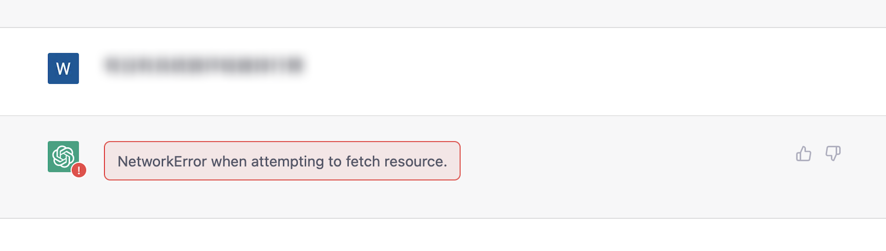
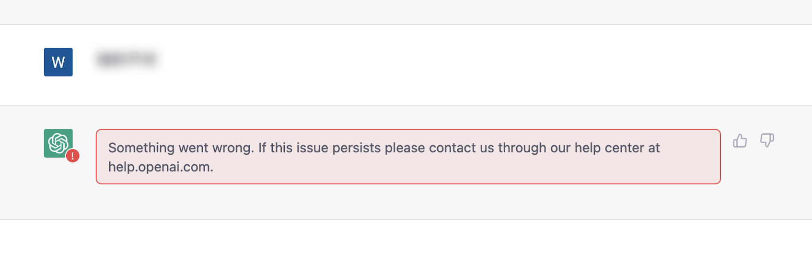
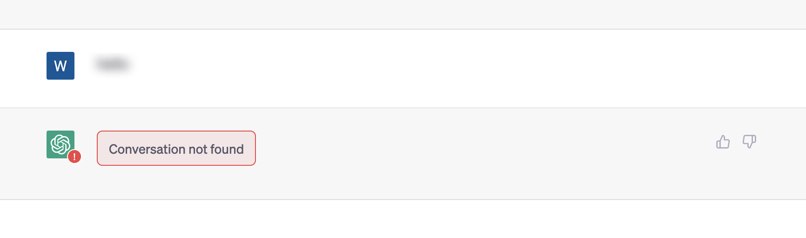
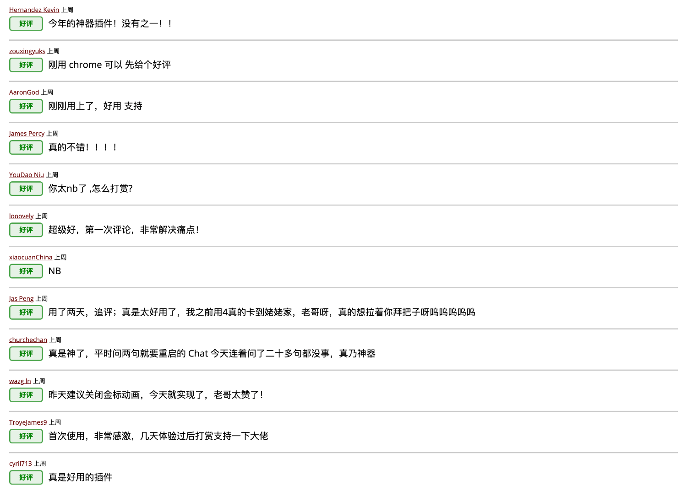
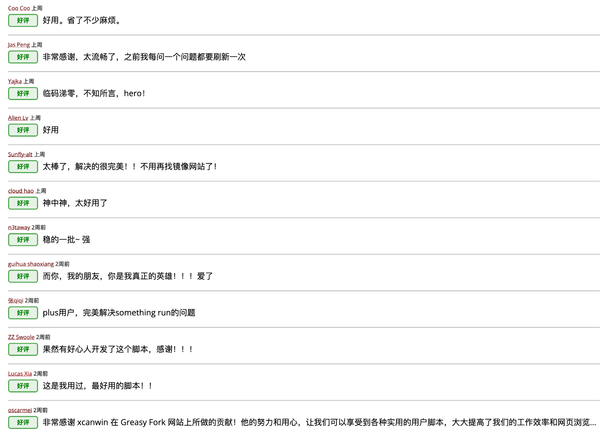
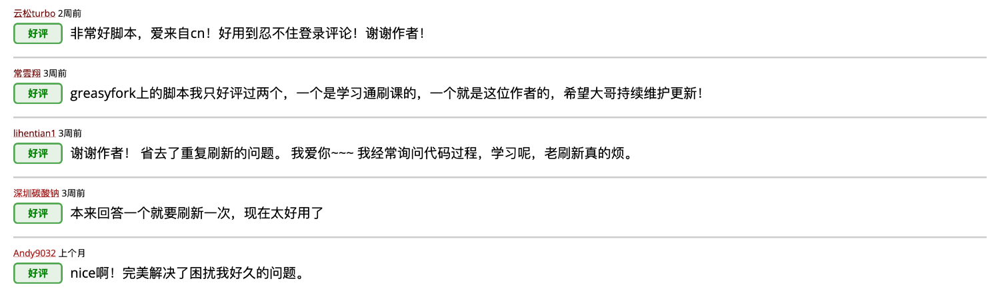

<center><p align="center"></img></p></center>


[中文文档](README.md) | [English README](README_EN.md) | [日本語 README](README_JA.md)


### ⚠️ セキュリティーアラート

- 必ず本記事で紹介している公式の[インストールリポジトリ](#install)を使用してください。
- 現在、[Chrome Web Store](https://chrome.google.com/webstore/category/extensions) に同名の非公式な拡張機能が見つかっています。


## プロジェクト内容

​- このスクリプトが気に入ったら、私の GitHub プロジェクト [KeepChatGPT](https://github.com/xcanwin/KeepChatGPT/) に ⭐️ をつけて支援してください

- これはオープンソースのフリーで効率的な ```ChatGPT``` チャットユーザースクリプト拡張機能で、チャットを非常にスムーズにし、様々な ```エラー``` や ```警告``` を一掃し、10ステップ余分に節約し、ページを常に更新することから手を解放することができます。
- R＆D資金がなく、純粋に愛の力で、寄付を歓迎します。[appreciation cat food](#appreciation) をありがとうございます

## 機能紹介

1. エラーを解消：```NetworkError when attempting to fetch resource.```
2. エラーを解消：```Something went wrong. If this issue persists please contact us through our help center at help.OpenAI.com.```
3. エラーを解消：```Conversation not found```
4. エラーを解消：```This content may violate our content policy. If you believe this to be in error, please submit your feedback — your input will aid our research in this area.```
5. コミュニケーション中に頻発する割り込みを解消
6. ウェブページが頻繁に更新される問題を解消
7. 多言語対応
8. ダイアログのユーザー名が誤ってコピーされる公式 BUG を解決しました
9. [バックエンド監視監査のキャンセル](#about-cancel-audit-function)を無料でサポート
10. モバイル対応 ([HarmonyOS](#usage-harmonyos-system)、[Android](#usage-android-system)、[iOS](#usage-apple-system))
11. [時間間隔を調整する](#about-adjust-interval-feature)を自由にサポート
12. [指定したダイアログを簡単にクローン化し、非破壊で編集する機能](#about-clone-dialogue-function)をサポート
13. [ページのピュリファイ](#about-purify-page-features)をサポート
14. 大画面ディスプレイに対応
15. フルスクリーン表示に対応

上記は機能の簡単な説明であり、機能の詳細な説明は本記事下段にあります。

そして、この記事の一番下の[その他の指示](#other-instructions)では、筆者が簡単に分析した[大規模ネットワークエラーが発生する理由](#about-why-large-scale-network-errors-occur)、共通のエラーメッセージ解決法

| 番号 | ```KeepChatGPT``` を使用すると、以下のシーンが二度と発生しなくなります |
| --- | --- |
| 1 | </img> |
| 2 | </img> |
| 3 | </img> |
| 4 | </img> |

## ユーザーのフィードバック

- 良いも悪いもある
- お褒めいただきありがとうございます
- 悪いところはどんどん更新していきます

</img>
</img>
</img>
</img>

## 比較

|          実験環境         |               ```KeepChatGPT``` を使用しない場合                |                ```KeepChatGPT``` を使用する場合                |
| :----------------------: | :----------------------------------------------------------: | :----------------------------------------------------------: |
|           現象           | チャットでネットワークエラーの赤い警告ボックスが10分おきに頻繁に表示され、ウェブページを更新する必要があります | ネットワークエラーが発生することはなく、ウェブページを更新する必要もありません |
|         ステップ 1        |                        プロンプトを出す                        |                         プロンプトを出す                         |
|         ステップ 2        |                          結果を待つ                           |                           結果を待つ                           |
|         ステップ 3        |                   ネットワークエラーに遭遇する                   |                           結果を得る                           |
|         ステップ 4        |                     再送信のクリックを試みる                     |                                                              |
|         ステップ 5        |                 ネットワークエラーに再度遭遇する                  |                                                              |
|         ステップ 6        |                   前回のプロンプトをコピーする                   |                                                              |
|         ステップ 7        |                     ウェブページを更新する                      |                                                              |
|         ステップ 8        |              ウェブページの読み込みが完了するのを待つ              |                                                              |
|         ステップ 9        |                  前回のチャットセッションを開く                  |                                                              |
|        ステップ 10        |                   前回のプロンプトを貼り付ける                   |                                                              |
|        ステップ 11        |                      再度プロンプトを出す                       |                                                              |
|        ステップ 12        |                        再び結果を待つ                          |                                                              |
|        ステップ 13        |                          結果を得る                           |                                                              |

- 比較すると、10以上の無駄なステップを省き、スムーズなチャットを可能にしていることがわかります。

## 表示

- AI 体験が劇的に変化する "Exclusive Gold Label" を無料で楽しめる:
- </img>
- ダークトーンが好きな人には、"Exclusive Gold Label "にマウスを合わせて "Theme "を選択すると、"Exclusive Blue Label "に変更できます:
- </img>
- モバイル:
- </img>

## 解説

- Headless を使用して、ページオープン時に Cloudflare のスパイダー検証を回避する。
- 非クリックで Cloudflare のランダムマシン検証を回避する。
- トラフィックを最小化する原則を守る。
- マウスを ```Exclusive Gold Label``` に合わせ、```Show Debugging``` を選択すると、迂回のプロセスが表示されます。

## 使用方法

推奨ブラウザは、```Chrome```、```Firefox```、```Edge``` およびこれら 3 つのブラウザと互換性のある他のブラウザです;

1. [Tampermonkey website](https://www.tampermonkey.net/) から ```Tampermonkey``` ブラウザ拡張機能をインストールします。
2. KeepChatGPT のインストールは、[インストールリポジトリ](#install)からリポジトリを選択することができます。
3. [ChatGPT](https://chat.OpenAI.com/chat) を開き、スムーズな体験を楽しむことができます。
4. さらにもっと賢い方法があります。それは、ChatGPT に尋ねることです: ```Tampermonkey 拡張機能をインストールする方法とは？Greasy Fork の usercript をインストールする方法は？```


## HarmonyOS システムでの使用方法

1. ブラウザは ```Firefox``` を推奨します;
2. Firefox ブラウザアプリをインストールします。[Huawei AppGallery](https://appgallery.huawei.com/app/C31765)、[Firefox 公式サイト](https://www.mozilla.org/firefox/browsers/mobile/android/)からダウンロードすることができます;
3. Firefox ブラウザアプリを起動し、右下の ```...``` > Add-ons > Add-ons Manager > ```Tampermonkey``` の右側にある ```+``` をクリックします;
4. ```KeepChatGPT``` ユーザースクリプトをインストールします。[インストールチャンネル](#installation-channel)からインストールするチャンネルを選択できます;

## Android システムでの使用方法

1. ブラウザは、```Firefox``` を推奨します;
2. Firefox ブラウザアプリをインストールします。[Playstore](https://play.google.com/store/apps/details?id=org.mozilla.firefox)、[Firefox 公式サイト](https://www.mozilla.org/firefox/browsers/mobile/android/)からダウンロードできます;
3. Firefox ブラウザアプリを起動し、右下の ```...``` > Add-ons > Add-ons Manager > ```Tampermonkey``` の右側にある ```+``` をクリックします;
4. ```KeepChatGPT``` ユーザースクリプトをインストールします。[インストールチャンネル](#installation-channel)からインストールするチャンネルを選択できます;

## Apple システムでの使用方法

1. 他のブラウザは Apple のポリシーによって制限され、JS プラグインをサポートすることはほとんどありません;
2. [App Store](https://apps.apple.com/app/id1591620171) からインストールできる ```Stay``` ブラウザ拡張アプリをインストールします;
3. [Stay 公式サイト](<https://github.com/shenruisi/Stay>)を参照し、操作方法を確認する;
4. ```KeepChatGPT``` プラグインをインストールします。[インストールチャンネル](#installation-channel)からインストールするチャンネルを選択できます;

## インストールチャンネル

|  | usercript ソース |
| --- | --- |
| 1 | [Github](https://raw.githubusercontent.com/xcanwin/KeepChatGPT/main/KeepChatGPT.user.js) |
| 2 | [GreasyFork](https://greasyfork.org/zh-CN/scripts/462804-keepchatgpt) |

- 作者は usercript のインストール方法しか提供しておらず、公式ソースは上記2つだけなので、公式ソースを探してみてください。
- 作者は、拡張機能よりも usercript の方が良いと考えています。いつでも誰でもセキュリティを監査することができ、密かにアップロードされたデータがないかどうか、誰でも調べることができる。
- ⚠️[Google App Store](https://chrome.google.com/webstore/category/extensions) 及び ⚠️[Microsoft App Store](https://microsoftedge.microsoft.com/) は、著者からの提供ではありません。そして、このプロジェクトの盗作だけでなくユーザーへの課金も行いました。

## その他の説明

### 大規模ネットワークエラーが発生する原因について

1. 世界的なチップ危機で世界のコンピューティングパワーが不足しており、OpenAI も存在する。
2. OpenAI が瞬く間にヒットし、同時にユーザー数、ユーザーオンライン時間、ユーザー頻度が急増し、リソース不足を深刻化させることになった。
3. AI プロダクトや AI ボットが大量に派生し、ChatGPT の API や Web 版 ChatGPT をプライベートで呼び出す頻度が、リアルユーザーの総数を遥かに上回るようになった。
4. OpenAI は ```Cloudflare``` に接続し、```強力な保護ルール```を有効にし、OpenAI に非公開で接続されている AI 製品や AI ボットを遮断する。
5. グラフィカル CAPTCHA と同様に、ボットを遮断することが目的でしたが、CAPTCHA が認識される危険性が出てくると、ウェブマスターはグラフィカル CAPTCHA をより複雑に開発し、実際のユーザーに影響を与えながらも、実際にボットを効果的に遮断しています。
6. Cloudflare は公共サービスであり、すべての Web サイトにサービスを提供しており、その保護ルールやリスクコントロール戦略は一般的なものです。クローラー、ボット、ハッカー、大量のトラフィックにアクセスされたくない多くのウェブサイトが Cloudflare に接続するため、Cloudflare は豊富なリスクコントロール戦略を持っています。
7. 海外ユーザーの多くはホームネットワークであり、Cloudflare はそのネットワークにリスクはないと判断しているため、ほとんどエラー報告がない。
8. 中国の国内ユーザーの多くは、様々な変位魔法（```666``` と呼ばれる）を使用しています。しかし、多くの ```666``` IP が Cloudflare の```強力な保護ルール```優先ウォッチリストに含まれているか、現在含まれています。この状況は、必ずしもユーザー自身に起因するものではないかもしれません。後続のユーザーに影響を与える以前のアクションの結果であったり、同じ C セグメント内の多くの IP によってリスクコントロールが頻繁にトリガーされる可能性があります。また、ユーザー自身が共有の ```666``` IP を使用していることに気づいておらず、それがリスクコントロールのトリガーになっている可能性もあります。その結果、Cloudflare は自社のネットワークにおける潜在的なリスクを特定し、エラーメッセージと実際のユーザーの信頼性を検証する必要性につながる。
9. これは氷山の一角であり、他にも様々な根本的な理由が考えられます。

### 本プラグインを使用してもネットワークエラーが発生する理由と解決方法について

1. [*原因 間隔調整機能について*](#about-adjust-interval-feature)を参照してください。解決方法 キープインターバルを適度に調整する。
2. [*理由 大規模ネットワークエラーが発生する理由*](#about-why-large-scale-network-errors-occur)を参照してください。解決策 IP、データセンター、インターネットサービスプロバイダ、チャンネルを変更する。

### エラーメッセージ 429 - 1 時間にリクエストが多すぎますの理由と解決方法。後で再試行してください

1. まず、429のエラーには多くの種類があります。[*その他のエラーについて*](#about-other-errors-causes-and-solutions) に記載がないか確認します。ない場合は、以下の可能性を考えてみてください：
2. 理由を教えてください： 新規に登録したユーザーや、同じ携帯電話で登録したユーザーには、OpenAI は無料クレジットを提供していません。詳しくは [OpenAI 公式サイト利用ページ](https://platform.OpenAI.com/account/usage)をご確認ください。解決方法 異なるメールアドレスと電話番号で登録してください。
3. 理由 クレジットを使い果たした。詳しくは [OpenAI 公式サイト利用ページ](https://platform.OpenAI.com/account/usage)をご確認ください。解決方法 リチャージしてクレジットを追加してください。
4. 原因： Cloudflare の不具合。解決方法 ブラウザのプライバシーモードか ChatGPT インスタンスを使用する。プライバシーモードが正常に動作する場合、通常のブラウジングモードで OpenAI.com ドメインとサブドメインに関連するすべてのクッキーとローカルストレージをクリアします。
5. 理由：共有の ```666``` IP を使用していることに気づいていない可能性があります。同じ IP 出口を持つオンラインの隣人のグループがあり、彼らは常に様々な目的で頻繁にリクエストをしています。彼らのトラフィックは高いのですが、429 エラーを誘発しないように、なんとか閾値以下にとどめています。しかし、このプラグインを使い始めると、彼らの足を引っ張り、突然 429 エラーに遭遇して困惑している。解決策 IP、データセンター、インターネットサービスプロバイダ、および ```666``` のチャンネルを変更する。

### 監査取り消し機能に関して

1. デフォルトでは、あなたのすべての会話は、OpenAI の公式[モデレーション](https://platform.OpenAI.com/docs/guides/moderation/overview)システムによって自動的に監査されます。OpenAI のモデレーションシステムが、あなたの会話に過度な違反や [OpenAI 利用ポリシー](https://OpenAI.com/policies/usage-policies)の違反を検出した場合、あなたのアカウントは制限され、禁止される危険性もあります。
2. 本プラグインの "Cancel Audit" 機能を **有効** にし、巧みな言葉選びを行うことで、その影響を最小限に抑えることができます。

### 時間間隔調整機能について

1. この値は、*keep*（接続を維持する）ための時間間隔を指し、*秒* で測定されます。
2. 時間間隔を大きくすると、キープ速度が遅くなり、ウェブサイトへの影響が少なくなり、より安全なアカウントになります。
3. 時間間隔が小さいほど、キープ速度が速く、ネットワークエラーの発生が少なくなります。
4. *30* 秒以上の間隔を推奨します。
5. 筆者は通常、*150* 秒に設定しています。

### クローン会話機能について

1. ChatGPT は、AI プロンプトプロジェクトに所属しています。
2. プロンプトエンジニアリングが最も力を入れていることのひとつは、ロボットが本当に理解し、その結果がお客様の要求を満たすと判明するまで、プロンプトワードを繰り返し調整することです。
3. プロンプトエンジニアリングが最も行うことの一つは、すでに投稿したものをコピー＆ペーストして、結果に満足する前にプロンプトの文言を繰り返し調整することです。
4. ダイアログを複製する ```Clone dialog``` をチェックした後、再最適化したいダイアログの前にあるアバターをクリックすると、すぐにダイアログボックスが表示されます。

### ピュリファイページの特徴について

1. 通常（Plus 以外）のユーザーにとって、ChatGPT のホームページ ```https://chat.OpenAI.com/``` は、無駄なプロンプトでいっぱいであることがよく見受けられます。
2. ピュリファイページを確認すると、トップページが新しくなり、PLUS ユーザーと同様のゴールドスタンダードを楽しむことができ、体験が改善されます。

### その他のエラーの原因と解決方法

 以下のエラーメッセージが表示される場合は、公式の解決策をご参照ください： [OpenAI 公式ドキュメント エラーコード](https://OpenAI.com/policies/usage-policies)
 401 - 認証が無効です
 401 - 提供された API キーが正しくありません
 401 - API を使用するには、組織のメンバーである必要があります
 429 - リクエストのレート制限に達しました
 429 - 現在のクォータを超えました。プランと請求の詳細を確認してください
 429 - 現在、エンジンが過負荷になっています
 500 - リクエストの処理中にサーバーにエラーが発生しました

### PLUS ユーザーがエラーを報告しない件について

- PLUS ユーザーは一般ユーザーと同じく破滅する。

## 感謝

- 役に立つ、すごい、スムーズ、素敵と思った方！
- 作者の小さな猫に、もっと美味しいキャットフードや缶詰が食べられますようにと願うなら。
- このプロジェクトがあなたの役に立ったなら。
- このプロジェクトがあなたの仕事の効率を向上させたのであれば。
- このプロジェクトが、OpenAI のエラーメッセージの新ラウンドを防ぐために、継続的にメンテナンスされることを望むのであれば。
- このプロジェクトが、より多くの機能でアップグレードし続けることを望むなら。
- 作ることは簡単ではありません。プロジェクトを維持するためには、時間、エネルギー、技術力が必要です。感謝と応援は大歓迎です。
- ノートに ID を書くことができます、ありがとうございます。

| From | Thanks |
| --- | --- |
| 私の猫 | </img> |
| Buymeacoffee | [</img>](https://www.buymeacoffee.com/xcanwin) |
| Afdian<br>(wechat、alipay に対応) | [</img>](https://afdian.net/a/xcanwin/plan) |
| Wechat<br>(うまくいかないこともあります) | </img> |
